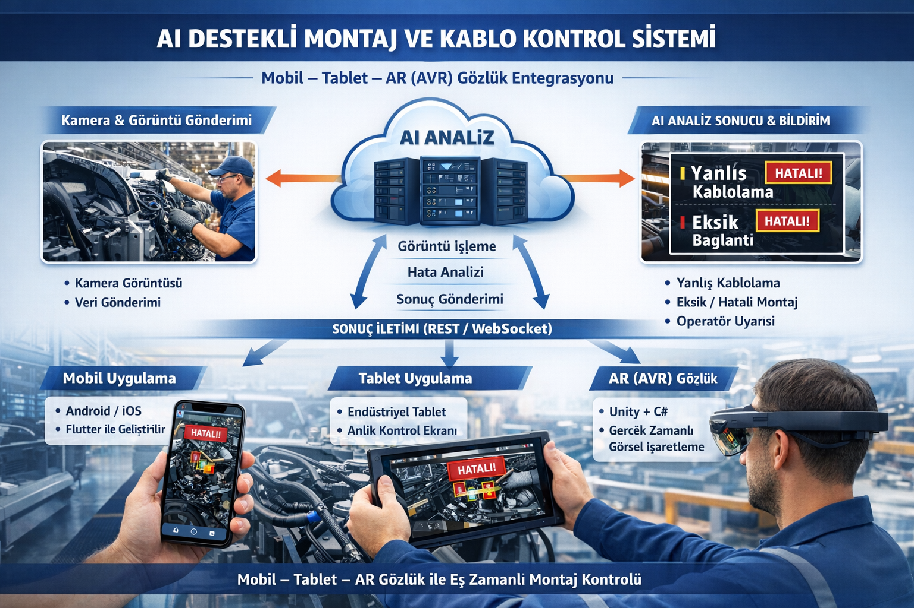

# YAPAY ZEKA DESTEKLİ MONTAJ & KABLOLAMA HATA TESPİT SİSTEMİ
## Teknik ve Ticari Teklif

### Proje 
Montaj hattında kablo ve parça montaj hatalarının görüntü işleme ve yapay zeka ile tespiti
### Hedef
Fabrika montaj hattı – mobil , tablet & AVR Gözlük Entegrasyon Destekli Operatör Arayüzü

### Projenin Amacı
Bu projenin amacı; montaj hattında gerçekleştirilen kablo montajlarının, bağlantı noktalarının ve parça yerleşimlerinin yapay zeka destekli görüntü işleme yöntemleri ile analiz edilerek;

yanlış kablolama,

eksik bağlantı,

yanlış parça veya yanlış yön montajı

gibi kalite hatalarının gerçek zamanlı veya yarı gerçek zamanlı olarak tespit edilmesidir.

### Proje Kapsamı

Sistem aşağıdaki fonksiyonları kapsayacaktır:

Kablo montaj doğruluğu kontrolü

Yanlış kablo / yanlış soket tespiti

Eksik bağlantı ve eksik parça tespiti

Yanlış yön / yanlış yerleşim tespiti

Kamera üzerinden görüntü alma ve analiz

Tablet ve mobil cihazlar için operatör arayüzü

Hata bildirimi ve kayıt altyapısı

Basit yönetim ve izleme ekranı

### Sistem Mimarisi – Genel Yaklaşım

Çözüm aşağıdaki ana bileşenlerden oluşacaktır:

Endüstriyel kamera veya mevcut kamera altyapısı

Görüntü işleme ve yapay zeka servisleri

Model eğitim ve doğrulama altyapısı

Mobil / tablet uygulaması

Merkezi servis ve API katmanı

AVR Gözlük ile Uygulama Entegrasyonu

AVR Gözlüğe Mobil ve Tablet Uygulamasının Entegresyanu

### Proof of Concept (PoC) Aşaması

Bu proje için klasik anlamda bir “demo” yerine Proof of Concept (PoC) çalışması önerilmektedir.

PoC’nin amacı

Sistemin gerçek üretim hattı koşullarında teknik olarak çalışabilirliğini ve başarı oranını doğrulamaktır.

PoC kapsamı

PoC çalışması aşağıdaki sınırlı kapsam ile yürütülecektir:

Seçilecek tek bir montaj istasyonu

Sınırlı parça ve kablo tipi

Sınırlı hata senaryosu

Tek kamera veya sınırlı kamera kurulumu

Sadece doğrulama amaçlı yapay zeka modeli

Tablet / mobil üzerinden temel operatör ekranı

Önemli not

PoC çalışması ticari ürün değildir.
Fizibilite ve teknik doğrulama amaçlı mühendislik çalışmasıdır.

PoC çalışması; saha verisi toplanması, görüntülerin etiketlenmesi, model eğitimi ve test faaliyetlerini içeren bir mühendislik sürecidir ve ücretsiz demo kapsamında değerlendirilemez.

### PoC Çıktıları

PoC sonunda aşağıdaki çıktılar sunulacaktır:

Seçilen istasyon için çalışan yapay zeka modeli

Temel mobil / tablet arayüzü

Tespit edilen hata senaryoları için doğruluk raporu

Sistem mimarisi ve teknik değerlendirme dokümanı

### PoC Sonrası Ürünleştirme Aşaması

PoC’nin başarılı olması durumunda;

model genişletme,

yeni istasyonların eklenmesi,

daha fazla parça ve kablo tipi,

merkezi yönetim paneli,

entegrasyon ihtiyaçları

ürünleştirme fazında hayata geçirilecektir.

PoC kapsamında geliştirilen yazılım, altyapı ve modeller ana ürün geliştirme sürecine doğrudan entegre edilir.

### Saha Koşulları ve Performans Etkileri

Aşağıdaki faktörlerin sistem performansını doğrudan etkilediği taraflarca kabul edilir:

Kamera konumu ve çözünürlüğü

Ortam ışığı ve gölge koşulları

Operatör hareketleri

Üretim temposu

Ürün varyasyonları

Model doğruluk oranları bu değişkenlere bağlı olarak farklılık gösterebilir.

## Proje Fazları
### Faz 1 – PoC Çalışması

Kamera montaj hata ve montajlama için test

Veri toplama

Görüntü etiketleme

Yapay zeka model eğitimi

Mobil / tablet temel arayüz

Saha testleri

### Faz 2 – Ürün Geliştirme

Yeni istasyonların eklenmesi

Genişletilmiş hata senaryoları

Performans iyileştirme

Yönetim paneli

Entegrasyonlar

### Faz 3 – Ürün Geliştirme1

AVR Gözlük ile uygulama  entegrasyonu

Servis Modülü Entegrasyonu

### Genel Değerlendirme

Bu proje;

klasik bir yazılım geliştirme projesi değil,

gerçek saha verisine,

üretim hattı koşullarına,

görüntü kalitesine ve ortam değişkenlerine

bağımlı, yüksek mühendislik içeren bir yapay zeka uygulamasıdır.

Bu nedenle sürecin PoC temelli ve kontrollü şekilde ilerlemesi önerilmektedir.

### Mobil, Tablet ve AR (AVR) Gözlük Tabanlı Operatör Arayüzü

(Görüntü analizi merkezi yapay zekâ servisinde yapılır)

Bu projede mobil uygulama, tablet uygulaması ve AR (AVR) gözlük uygulaması aynı görüntü analiz altyapısını kullanan birleşik istemci mimarisi olarak tasarlanacaktır.

Araç montajının doğru yapılıp yapılmadığının görüntü analizi, istemci cihazlar üzerinde değil, merkezi yapay zekâ servisleri üzerinde gerçekleştirilecektir.

Mobil, tablet ve AR gözlük uygulamaları; kamera görüntüsünü almak, analizi başlatmak ve analiz sonucunu operatöre göstermek amacıyla kullanılacaktır.

### Mobil ve Tablet Uygulaması – Kullanılacak Teknolojiler

Flutter

Dart

Android SDK

iOS SDK

HTTP / REST Client

WebSocket client (anlık analiz sonucu ve durum güncellemeleri için)

### AR (AVR) Gözlük Uygulaması – Kullanılacak Teknolojiler
AR gözlük uygulaması, mobil ve tablet uygulamaları ile aynı analiz servislerine bağlanan bir kontrol ve görselleştirme istemcisi olarak çalışacaktır.

Kullanılacak temel teknolojiler

Unity 3D (AR gözlük istemci uygulaması)

C#

OpenXR (farklı AR / XR gözlük modelleri ile uyumluluk için)

Cihaz gereksinimine bağlı olarak desteklenebilecek altyapılar:

ARCore

ARKit

### AR Gözlük Uygulama Katmanı (İstemci tarafı)
AR gözlük uygulaması aşağıdaki fonksiyonları yerine getirecektir:

kamera görüntüsü üzerinde analiz sonucunun bindirilmesi (overlay)

yanlış montaj veya eksik bağlantı bölgesinin görsel olarak işaretlenmesi

doğru / yanlış montaj bilgisinin gösterilmesi

operatör onay ve geri bildirim ekranları

Bu katmanda yalnızca görselleştirme ve kullanıcı etkileşimi yapılacaktır.

### Mobil – Tablet – AR Gözlük Ortak Haberleşme ve Güvenlik Teknolojileri

Tüm istemci uygulamaları için ortak olarak:

RESTful API

JSON veri formatı

WebSocket (gerçek zamanlı analiz sonucu iletimi)

JWT tabanlı kimlik doğrulama

kullanılacaktır.

### Birleşik kullanım senaryosu

Aynı araç için;

mobil uygulama,

tablet uygulaması ve

AR gözlük uygulaması

eş zamanlı olarak aynı analiz sonucunu görüntüleyebilir ve montaj doğrulaması yapılabilir.

## Proje Tamamlama Süresi

Bu yapılan çalışma tahmini süredir. Elbette zamanlarda tolerans gösterilmesi talep edilebilir.Aşağıda tek tabloda,
- yapay zekâ
- backend
- mobil & tablet
- AVR (AR gözlük)
tüm işleri birlikte ve zamanlarıyla görebileceğin net bir iş listesi var.

### Proje İş Listesi ve Süre Tablosu

| Numara  | İş Paketi / Faz |Kapsam |Yapılacak işler |Süre |
| ------------- | ------------- | ------------- | ------------- | ------------- |
| 1   | Saha analizi ve gereksinim çalışması  |Tümü  |Montaj istasyonu seçimi, kamera konum analizi, kablo / soket / parça tiplerinin belirlenmesi, hata tiplerinin tanımı, performans hedefleri, saha çalışma planı  |1 ay|
| 2   | Görüntü veri toplama |Yapay Zeka |Gerçek montaj hattından görüntü ve video toplama, farklı ışık ve açı senaryoları, hatalı montaj örneklerinin oluşturulması  |1 Ay  |
| 3   | Görüntü etiketleme ve veri hazırlığı  |Yapay zekâ |Kablo, soket, bağlantı noktası etiketleme, eksik bağlantı ve yanlış montaj etiketleri, veri kalite kontrolü  |1 ay |
| 4   | Yapay zekâ model geliştirme  |Yapay zekâ  |Kablo ve soket tespiti, bağlantı var/yok tespiti, yanlış parça / yanlış soket sınıflandırma, yanlış yön montaj tespiti, ilk doğruluk testleri  |1 Ay |
| 5   | Yapay zekâ servis katmanı  |Yapay zekâ + Backend |Model inference servisleri, görüntü işleme pipeline’ı, model servisleştirme, çoklu istek yönetimi  |1 Ay  |
| 6   | Backend ve merkezi sistem altyapısı  |Backend  |REST servisleri, WebSocket altyapısı, analiz başlatma servisleri, sonuç yayınlama, hata kayıt altyapısı, JWT kimlik doğrulama  |1 Ay  |
| 7   | Mobil ve tablet uygulaması – temel  |Mobil / Tablet  |Operatör girişi, kamera ile görüntü alma, analiz başlatma, canlı analiz sonucu ekranı, hatalı bölge gösterimi, hata türü ekranları  | 1 Ay  |
| 8   | Mobil ve tablet uygulaması – gelişmiş  |Mobil / Tablet  |Çoklu araç ve oturum yönetimi, bağlantı yönetimi, performans iyileştirme, tablet ekran uyarlamaları, kullanıcı deneyimi iyileştirme  |1 Ay |
| 9   | Sistem entegrasyonu  |Tümü  |Kamera – yapay zekâ servisleri – backend – mobil / tablet entegrasyonu, uçtan uca testler |15 Gün |
| 10  | Saha testleri ve model iyileştirme |Yapay zekâ + Mobil/Tablet |Gerçek hatta test, yanlış pozitif azaltma, kamera kalibrasyonu, yeniden eğitim (fine-tuning)  |15 Gün  |
| 11  | Pilot kullanım ve ürünleşmeye hazırlık  |Tümü  |Operatör geri bildirimleri, mobil/tablet arayüz revizyonları, güvenlik testleri, raporlama ve dokümantasyon  |1 Ay  |
| 12  |Toplam  |   |   |8 Ay  |

Mobil + Tablet + Yapay zekâ + Backend = 8 ay

### AVR (AR Gözlük) Ek Faz – Ayrı Kalem

| Numara  | İş Paketi / Faz |Kapsam |Yapılacak işler |Süre |
| ------------- | ------------- |------------- |------------- |------------- |
| 13  | AVR istemci altyapısı  |AVR  |Unity tabanlı uygulama kurulumu, kamera erişimi, merkezi yapay zekâ servislerine bağlantı, WebSocket altyapısı, oturum eşleştirme |1 Ay |
| 14  | AVR görselleştirme ve montaj doğrulama  |AVR  |Analiz sonuçlarının gözlükte alınması, görüntü üzerine overlay bindirme, hatalı bölgenin işaretlenmesi, doğru/yanlış montaj göstergeleri, operatör onay ekranları  |1 Ay |
| 15 | AVR entegrasyonu ve saha testleri  |AVR  |Mobil–tablet–gözlük eş zamanlı kullanım, gecikme optimizasyonu, hizalama testleri, ergonomi ve pilot saha kullanımı  |1 Ay  |
| 16  | Toplam |   |   |3 Ay  |

AVR (AR Gözlük) toplam süresi = 3 ay

